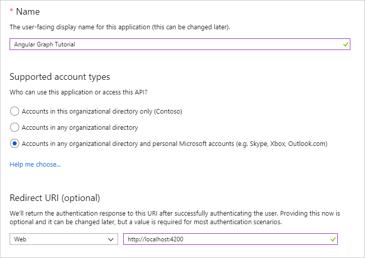

<!-- markdownlint-disable MD002 MD041 -->

Dans cet exercice, vous allez créer une inscription de l'application Web Azure AD à l'aide du centre d'administration Azure Active Directory.

1. Ouvrez un navigateur et accédez au [Centre d'administration Azure Active Directory](https://aad.portal.azure.com). Connectez-vous à l'aide d'un compte **personnel** (alias Microsoft) ou **compte professionnel ou scolaire**.

1. Sélectionnez **Azure Active Directory** dans le volet de navigation de gauche, puis sélectionnez **inscriptions des applications (aperçu)** sous **gérer**.

    

1. Sélectionnez **nouvelle inscription**. Sur la page **inscrire une application** , définissez les valeurs comme suit.

    - Définissez **nom** sur `Angular Graph Tutorial`.
    - Définissez les types de comptes **pris en charge** sur **les comptes de tous les comptes d'annuaire et de Microsoft personnels**.
    - Sous **URI**de redirection, définissez la première liste déroulante sur `Web` et définissez la `http://localhost:4200`valeur sur.

    

1. Sélectionnez **Enregistrer**. Sur la page **didacticiel de graphique angulaire** , copiez la valeur de l' **ID d'application (client)** et enregistrez-la, vous en aurez besoin à l'étape suivante.

    

1. Sélectionnez **authentification** sous **gérer**. Recherchez la section **Grant implicite** et activez les **jetons d'accès** et les **jetons ID**. Cliquez sur **Enregistrer**.

    
